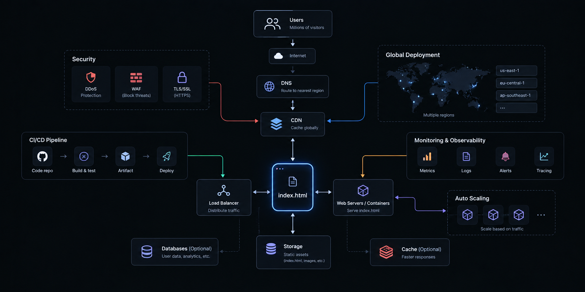

# CVAsCode

Deploying an `index.html` file is easy. Building a secure, reliable website that can serve millions of visitors is a different challenge.

CVAsCode explores that challenge through a production-focused cloud resume platform on AWS. The project uses Terraform to manage infrastructure, with CloudFront, S3, Route 53(WIP b/c aws don't let me have my own domain name for now), Lambda, API Gateway, and DynamoDB and ...
