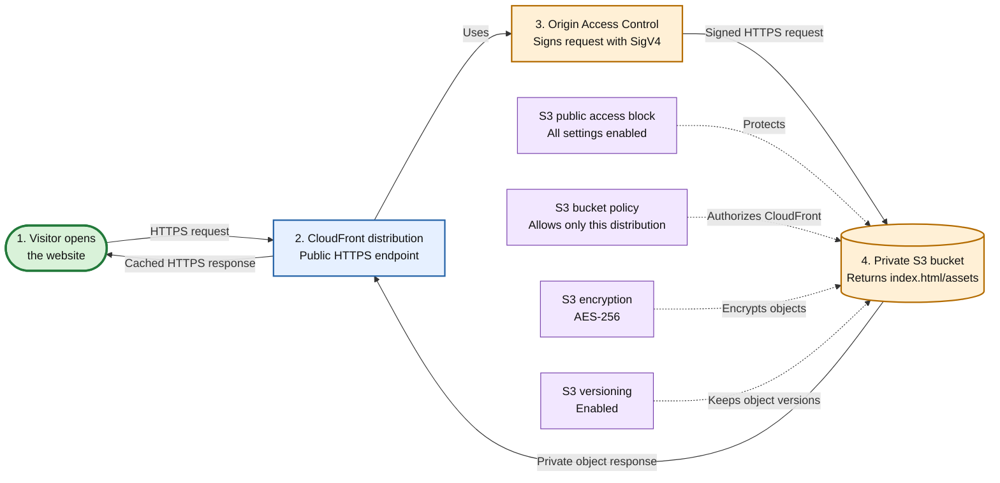
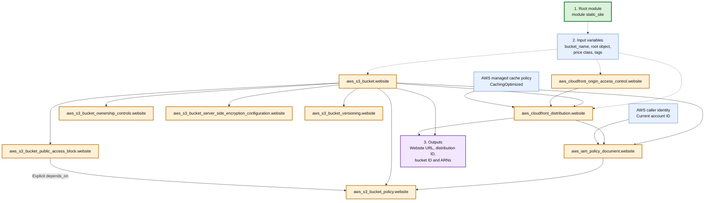

# Private Static Website Architecture

This module creates a private Amazon S3 bucket and exposes its website files only through Amazon CloudFront. CloudFront uses Origin Access Control (OAC) to sign each request to S3.

## Request Flow

Start at **1. Visitor** and follow the numbered arrows.

The S3 bucket is not an S3 website endpoint and cannot be opened directly from the internet. CloudFront uses the bucket's regional REST endpoint because OAC does not support S3 website endpoints.

## Terraform Dependency Flow

Start at **1. Root module**. Solid arrows show resource references that Terraform uses to determine creation order. Dotted arrows show configuration inputs.

## Starting Points

1. **Terraform deployment:** Run Terraform from a live root module that calls `modules/static-site`. Do not run the reusable module directly for a real environment.
2. **Website request:** A visitor starts at the CloudFront HTTPS URL returned by `website_url`.
3. **Website upload:** Upload `index.html` and other static files to the S3 bucket returned by `bucket_id`.
4. **Private access:** CloudFront signs origin requests through OAC. The bucket policy accepts requests only when `AWS:SourceArn` matches this CloudFront distribution.

## Creation Sequence

Terraform builds independent resources in parallel, so the exact order can vary. The effective sequence is:

1. Read module inputs, the AWS account ID, and the managed CloudFront cache policy.
2. Create the S3 bucket and CloudFront OAC.
3. Configure the bucket's public-access block, ownership, encryption, and versioning.
4. Create the CloudFront distribution using the S3 regional endpoint and OAC.
5. Generate and attach the bucket policy after the distribution ARN is known.
6. Return the bucket and CloudFront outputs.
