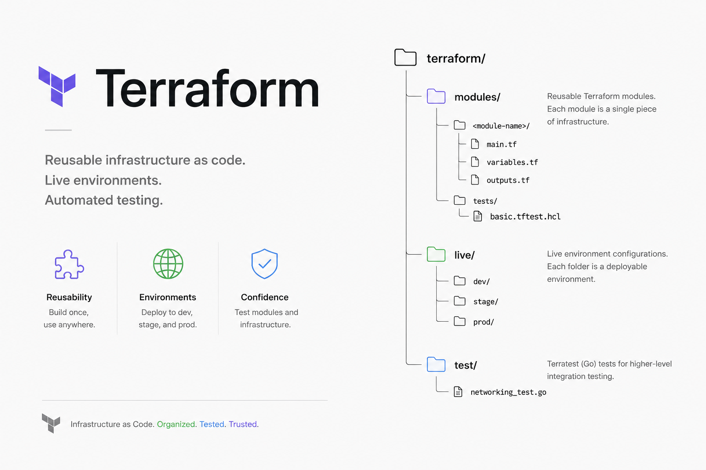

# Terraform



This folder currently contains reusable Terraform modules.

## Folder Structure

```text
terraform/
├── modules/
│   └── static-site/
│       ├── main.tf
│       ├── outputs.tf
│       ├── variables.tf
│       └── versions.tf
└── readme.md
```

## `modules/`

Reusable Terraform modules live here. A module should define one clear piece of infrastructure, such as networking, a database, or an application service.

Current module layout:

```text
modules/static-site/
├── main.tf
├── outputs.tf
├── variables.tf
└── versions.tf
```
